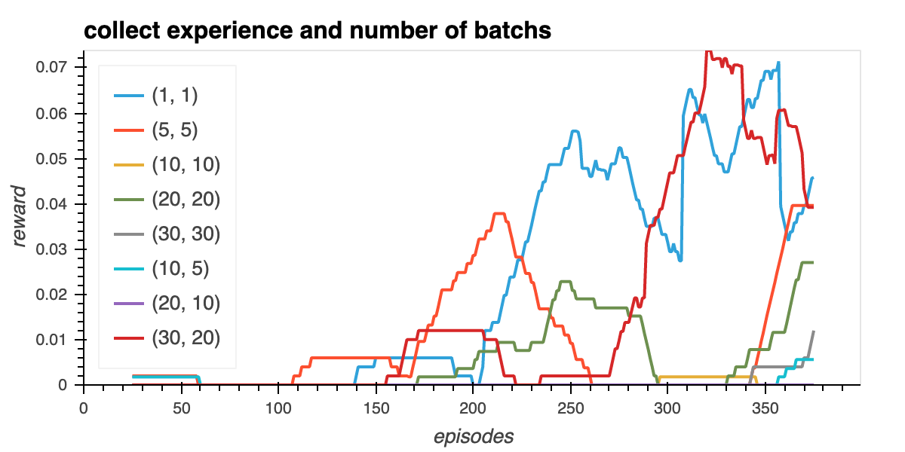
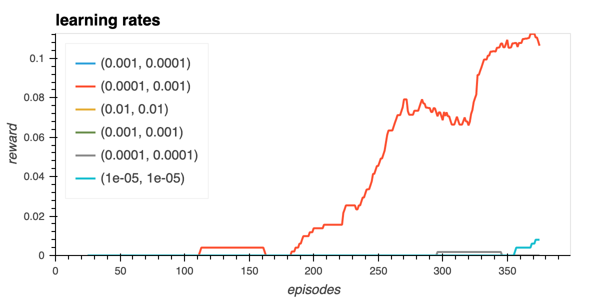
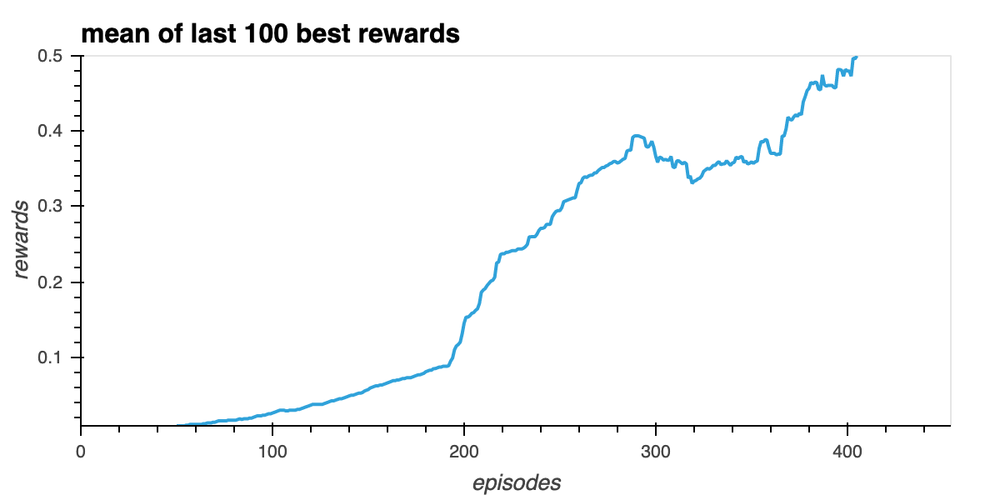

# Learning algorithm.
As in previous project, the agent uses the DDPG reinforcement strategy to learn from interactions with the environment, as explained in this [paper](https://arxiv.org/pdf/1509.02971.pdf).

Agent is trained in file `train.py`.

The DDPG algorithm is said to be part of Actor Critic models, but in fact differs from the plain vanilla Actor-Critic algorithm.
The DDPG agent is made of:
-  an `Actor` neural network, which uses a deterministic policy to decide which action to take, is trained using the deterministic policy gradient algorithm.
- a `Critic` neural network, calculating action value, is trained using TD-error.

In order to be more stable, additional `target` copies are made of both Actors and Critic, and soft update is used to gradually update the `target` weights from `local` values, while networks are trained.
Experience replay is also used to improve stability: past experience run against the environment are stored in a buffer, and each agent training is made on a random selection of past trajectories, then preventing sequences of actions reenforcing themselves.

Structure is as follows:

Actor:
- Input Layer: 24
- FCL (fully connected layer) 1: 256 (relu activation function)
- FCL 2: 512 (relu)
- Output Layer: 2 (actions)

Critic:

- Input Layer: 24
- FCL (fully connected layer) 1: 256 (relu activation function)
- FCL 2: 512 (relu)
- Output Layer: 2 (actions)

# Implemented improvements:

Additionally to the initial code provided in Udacity repository, we implemented following improvements:

- experience replay: we decided to parametrize the number of consecutive episodes collected to the buffer before training the actors, as well as the number of trajectories used for each session of training. See later for optimal parameters.

- gradient clipping was also implemented for the actor network to increase stability.

- we also added a process to make soft update decrease gradually as time passes, with tau_start, tau_end, tau_factor parameters. This improved convergence speed.

# Improvement in agent performance varying hyperparameters:

In order to run all simulations, insert at the end of `train.py` file range of parameters you want to run, then run `python train.py`. Simulation results will be stored in subdirectory `./results`.
Results visualizations are generated in notebook `hyperParametersTuning. result analysis.ipynb`, and shown below.
As simulations were computer time consuming, parameters optimization were done only on first 400 steps.

Here are hyperparameters we have tested;

 - collect steps and update trajectories number:

    We see that all agents manage to learn, but renning on a larger number of episodes should ne necessary to take a decison
    We observe a great sensitivity to these parameters for learning speed.

 - learning_rates:

    For Actor and Critic learning rates, we see again a great variability, from almost flat learning for high learning rates (1e-2, 1e-2) to fastest learning for lower values (1e-4, 1e-3)

# Most successful agent weights:

We saved pytorch agent weights into files `actor.pth` and `critic.pth`. For this best agent, we reach the target of an average max reward for both players of 0.5 on the last 420 episodes.

Here are best parameters used:
- mu = 0.0
- theta= .2
- sigma = .4

- collect sequence number  = 10
- update number =  10
- actor learning rate = 1e-4
- critic learning rate = 1e-3

- factor = .6
- doClip = True
- network actor = 256
- network actor = 512

- tau_start = 0.01
- tau_end = 0.001
- tau_factor = 0.999

    
    

## Next steps for improvements:

- Hyperparameters optimization is a tedious task if run with ranges from a baseline. We could instead use a method of hill climbing to reach parameter optimal combination, or use a Bayesian optimization search to explore the parameter space a smarter way, as explained for example in [this package](https://github.com/fmfn/BayesianOptimization).

- Parallelizing simulations would be great to test influence of each parameter variation on agent convergence speed. Docker implementation woudl help in this task, as currently only one Unity environement can run per operational system (Singleton).

- We could also use more typical actor critic agents to solve this problem, like TRPO or PPO, and compare the results.

- Implement prioritized [Experience replay](https://arxiv.org/abs/1511.05952) would improve the experience sampling by the buffer.